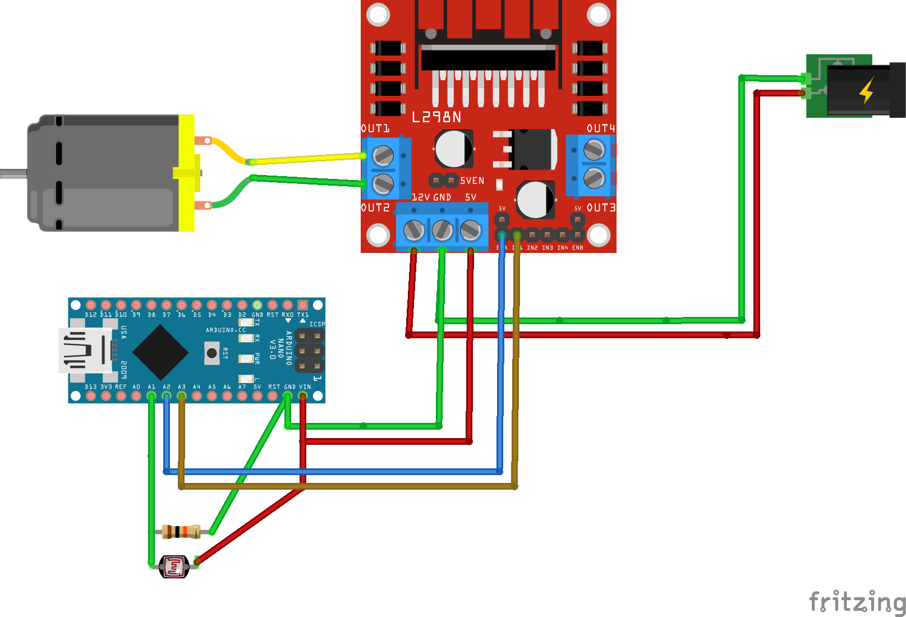

# Arduino Automatic Door Control System

## Overview
This project is an automated door control system that uses an Arduino to operate a motorized door based on ambient light conditions. The door automatically opens when it's bright outside and closes when it gets dark, making it ideal for chicken coops, greenhouses, pet doors, or any application requiring light-based automation.

## Features
- **Light-Based Operation**: Opens the door when brightness exceeds threshold, closes when darkness is detected
- **Confirmation Check**: Double-checks light readings before closing to prevent accidental operation
- **Status Logging**: Provides detailed serial output for monitoring and debugging
- **Configurable Parameters**: Easy adjustment of light thresholds and timing values

## Circuit Diagram



## Hardware Requirements
- Arduino board (Uno, Nano, or similar)
- Motor driver or relay module (to control door motor)
- DC motor for door operation
- Photoresistor/light sensor connected to analog pin A1
- 10kΩ resistor (for photoresistor voltage divider)
- Power supply appropriate for your motor
- Door mechanism (cables, pulleys, etc.)

## Pin Configuration
- **A1**: Light sensor input (analog)
- **D2**: Door down motor control
- **D3**: Door up motor control

## Installation and Setup
1. Connect the hardware according to the circuit diagram
2. Upload the provided Arduino sketch to your board
3. Calibrate the light thresholds if necessary
4. Mount the light sensor where it can accurately detect outdoor light conditions
5. Connect the motor to your door mechanism

## Code Configuration
You can adjust the following parameters in the code to match your specific requirements:

```cpp
const int BRIGHTNESS_HIGH_THRESHOLD = 400;  // Threshold for raising door
const int BRIGHTNESS_LOW_THRESHOLD = 100;   // Threshold for lowering door
const int DOOR_MOVEMENT_DELAY = 11000;      // Time required for door movement (milliseconds)
const int SENSOR_READ_DELAY = 2000;         // Delay between sensor readings (milliseconds)
```

## Operation Logic
1. The system reads the brightness value from the light sensor
2. If brightness is above the high threshold and the door is closed, it opens the door
3. If brightness is below the low threshold and the door is open, it waits and confirms the reading before closing the door
4. The system continuously monitors light levels and maintains door position when no action is needed

## Troubleshooting
- **Door timing issues**: Adjust `DOOR_MOVEMENT_DELAY` to match your specific door and motor
- **Inconsistent operation**: Check light sensor placement and adjust thresholds
- **Motor not moving**: Verify connections and power to the motor driver

## Future Improvements
- Add temperature sensing and LCD for additional control parameters
- Create a mobile app for remote monitoring and control
- Add manual override button
