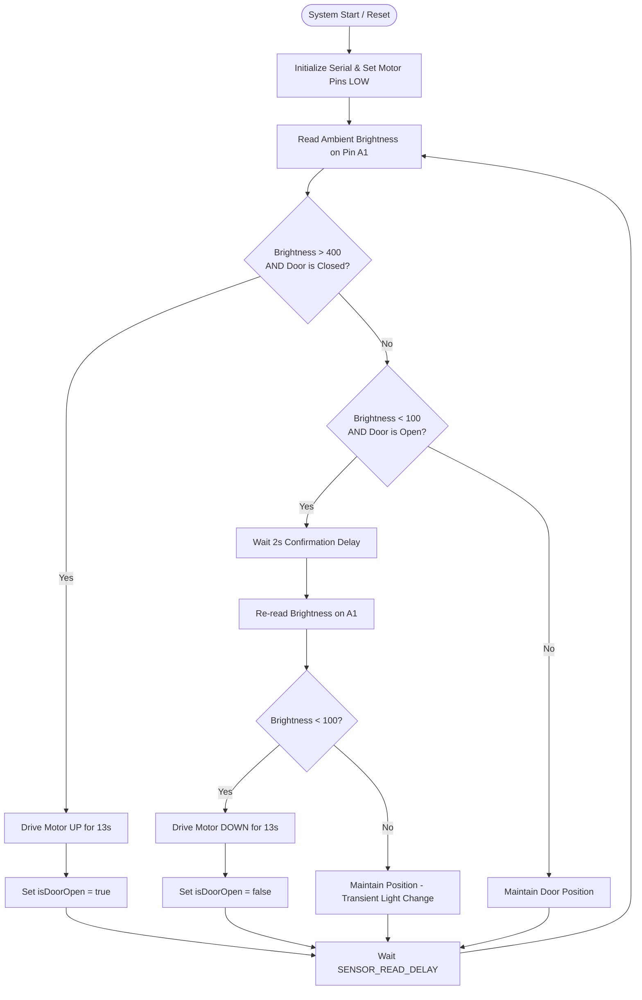
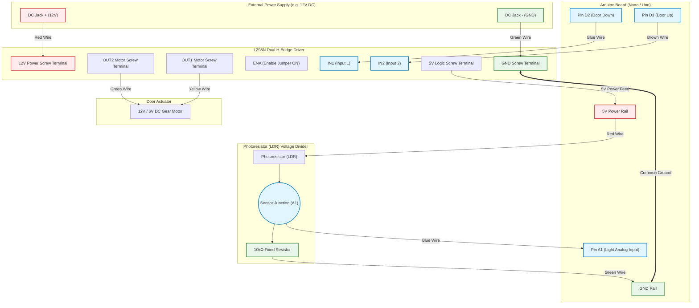
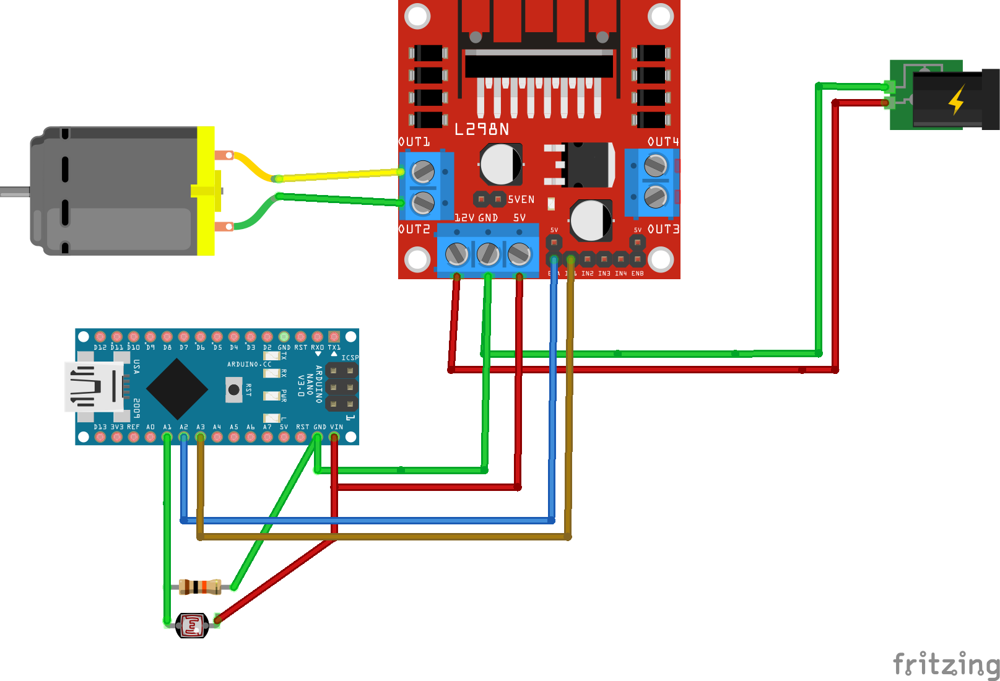

# Arduino Automatic Door Control System (Hühnerstall)

An automated door control system using an Arduino to open and close a coop or pet door based on ambient light conditions. The system automatically opens the door at sunrise and secures it at dusk, featuring threshold hysteresis and reading confirmation to avoid accidental triggers.

---

## 📋 Features

- **Automated Light-Based Operation**: Opens when ambient brightness exceeds the daylight threshold and closes when darkness is detected.
- **Hysteresis & Confirmation**: Distinct opening (`400`) and closing (`100`) thresholds prevent rapid switching during twilight, with a secondary confirmation check before closing.
- **Serial Diagnostics**: Detailed logging over USB serial (`9600` baud) for real-time monitoring and threshold calibration.
- **Configurable Timings**: Easily adjust motor travel time and sensor polling intervals to match your specific hardware setup.

---

## 📐 Technical Architecture & Logic

### System Architecture Flowchart


```mermaid
flowchart TD
    Start([System Start / Reset]) --> Init[Initialize Serial & Set Motor Pins LOW]
    Init --> LoopStart[Read Ambient Brightness on Pin A1]

    LoopStart --> CheckOpen{Brightness > 400\nAND Door is Closed?}
    CheckOpen -- Yes --> OpenDoor[Drive Motor UP for 13s]
    OpenDoor --> SetOpenState[Set isDoorOpen = true]
    SetOpenState --> DelayLoop[Wait SENSOR_READ_DELAY]

    CheckOpen -- No --> CheckClose{Brightness < 100\nAND Door is Open?}
    CheckClose -- Yes --> ConfirmDelay[Wait 2s Confirmation Delay]
    ConfirmDelay --> Recheck[Re-read Brightness on A1]
    Recheck --> StillDark{Brightness < 100?}
    
    StillDark -- Yes --> CloseDoor[Drive Motor DOWN for 13s]
    CloseDoor --> SetClosedState[Set isDoorOpen = false]
    SetClosedState --> DelayLoop
    
    StillDark -- No --> IgnoreClose[Maintain Position - Transient Light Change]
    IgnoreClose --> DelayLoop

    CheckClose -- No --> NoAction[Maintain Door Position]
    NoAction --> DelayLoop

    DelayLoop --> LoopStart
```

### State Transition Table

| Current State | Brightness Reading | Condition / Verification | Next State | Action Taken |
| :--- | :--- | :--- | :--- | :--- |
| **Closed** (`false`) | `> 400` | Brightness > High threshold | **Open** (`true`) | Motor drives UP for 13 seconds |
| **Closed** (`false`) | `≤ 400` | Below High threshold | **Closed** (`false`) | No action; door remains closed |
| **Open** (`true`) | `< 100` | Re-verified `< 100` after 2s | **Closed** (`false`) | Motor drives DOWN for 13 seconds |
| **Open** (`true`) | `< 100` | Re-check `≥ 100` (transient) | **Open** (`true`) | Abort close; door remains open |
| **Open** (`true`) | `≥ 100` | Above Low threshold | **Open** (`true`) | No action; door remains open |

---

## 🔌 Circuit & Hardware

### 1. Wiring & Schematic Diagram


```mermaid
graph TD
    subgraph Power["External Power Supply (e.g. 12V DC)"]
        VCC_EXT["DC Jack + (12V)"]
        GND_EXT["DC Jack - (GND)"]
    end

    subgraph L298N["L298N Dual H-Bridge Driver"]
        L_12V["12V Power Screw Terminal"]
        L_GND["GND Screw Terminal"]
        L_5V["5V Logic Screw Terminal"]
        ENA["ENA (Enable Jumper ON)"]
        IN1["IN1 (Input 1)"]
        IN2["IN2 (Input 2)"]
        OUT1["OUT1 Motor Screw Terminal"]
        OUT2["OUT2 Motor Screw Terminal"]
    end

    subgraph Arduino["Arduino Board (Nano / Uno)"]
        ARD_5V["5V Power Rail"]
        ARD_GND["GND Rail"]
        ARD_D2["Pin D2 (Door Down)"]
        ARD_D3["Pin D3 (Door Up)"]
        ARD_A1["Pin A1 (Light Analog Input)"]
    end

    subgraph Sensor["Photoresistor (LDR) Voltage Divider"]
        LDR["Photoresistor (LDR)"]
        R10K["10kΩ Fixed Resistor"]
        DIV_NODE(("Sensor Junction (A1)"))
    end

    subgraph Actuator["Door Actuator"]
        MOTOR["12V / 6V DC Gear Motor"]
    end

    %% Power Distribution
    VCC_EXT -->|Red Wire| L_12V
    GND_EXT -->|Green Wire| L_GND
    L_GND <==>|Common Ground| ARD_GND
    L_5V -->|5V Power Feed| ARD_5V

    %% Motor Signals
    ARD_D2 -->|Blue Wire| IN1
    ARD_D3 -->|Brown Wire| IN2
    OUT1 -->|Yellow Wire| MOTOR
    OUT2 -->|Green Wire| MOTOR

    %% Light Sensor Circuit
    ARD_5V -->|Red Wire| LDR
    LDR --> DIV_NODE
    DIV_NODE -->|Blue Wire| ARD_A1
    DIV_NODE --> R10K
    R10K -->|Green Wire| ARD_GND

    classDef pwr fill:#ffebee,stroke:#c62828,stroke-width:2px;
    classDef gnd fill:#e8f5e9,stroke:#2e7d32,stroke-width:2px;
    classDef sig fill:#e1f5fe,stroke:#0277bd,stroke-width:2px;
    class VCC_EXT,L_12V,ARD_5V pwr;
    class GND_EXT,L_GND,ARD_GND,R10K gnd;
    class ARD_D2,ARD_D3,ARD_A1,IN1,IN2,DIV_NODE sig;
```

### 2. Physical Layout (Fritzing)



### 3. Detailed Pin-to-Pin Wiring Table

| Source Device | Source Pin / Terminal | Destination Device | Destination Pin | Typical Wire Color | Function / Description |
| :--- | :--- | :--- | :--- | :--- | :--- |
| **DC Power Supply** | `+12V` (Positive) | **L298N Module** | `12V` Screw Terminal | 🔴 Red | Motor driving power supply |
| **DC Power Supply** | `GND` (Negative) | **L298N Module** | `GND` Screw Terminal | 🟢 Green / ⚫ Black | Main DC power return |
| **L298N Module** | `GND` Terminal | **Arduino Nano** | `GND` Pin | 🟢 Green / ⚫ Black | **Common Ground reference** (Mandatory) |
| **L298N Module** | `5V` Terminal | **Arduino Nano** | `5V` Pin | 🔴 Red | Powers Arduino from L298N onboard regulator |
| **Arduino Nano** | `D2` | **L298N Module** | `IN1` | 🔵 Blue | Signal to drive motor DOWN (lower door) |
| **Arduino Nano** | `D3` | **L298N Module** | `IN2` | 🟤 Brown | Signal to drive motor UP (raise door) |
| **L298N Module** | `OUT1` & `OUT2` | **DC Motor** | Motor Terminals (+ / -) | 🟡 Yellow / 🟢 Green | Motor drive outputs |
| **Arduino Nano** | `5V` | **LDR (Photoresistor)** | Leg 1 | 🔴 Red | Voltage divider supply (5V) |
| **LDR (Photoresistor)** | Leg 2 | **Sensor Junction** | Node to `A1` & Resistor | 🔵 Blue | Voltage divider output |
| **Sensor Junction** | Node | **Arduino Nano** | `A1` Pin | 🔵 Blue | Analog light level reading (0 - 1023) |
| **Sensor Junction** | Node | **10kΩ Resistor** | Leg 1 | — | Pull-down resistor input |
| **10kΩ Resistor** | Leg 2 | **Arduino Nano** | `GND` Pin | 🟢 Green | Ground return for voltage divider |

### 4. Circuit Notes & Best Practices

- **Common Ground**: Ensure the external power supply GND, the L298N GND terminal, and the Arduino GND pin are all connected together. Without a common ground reference, logic signals to `IN1`/`IN2` will float and behave erratically.
- **L298N 5V Regulator Jumper (`5VEN`)**: Keep the onboard 5V enable jumper closed if external supply voltage is between 7V and 12V. This enables the onboard LM78M05 voltage regulator to supply 5V logic power to the Arduino via the 5V terminal.
- **LDR Voltage Divider Formula**:
  \[
  V_{\text{out}} = V_{\text{cc}} \times \frac{R_{\text{fixed}}}{R_{\text{LDR}} + R_{\text{fixed}}}
  \]
  In bright light, \(R_{\text{LDR}}\) decreases (\(\approx 1\text{k}\Omega\)), making \(V_{\text{out}}\) approach 5V (high analog reading \(\approx 800 - 950\)). In darkness, \(R_{\text{LDR}}\) increases (\(\ge 100\text{k}\Omega\)), making \(V_{\text{out}}\) drop towards 0V (low analog reading \(\le 100\)).

### 5. Hardware Bill of Materials (BOM)

- **Microcontroller**: Arduino Nano V3.0 (ATmega328P) or Arduino Uno
- **Motor Driver**: L298N Dual H-Bridge Motor Driver Module
- **Motor**: 12V / 6V DC High-Torque Gear Motor (with spool or drive pulley)
- **Light Sensor**: 5mm GL5528 LDR Photoresistor
- **Fixed Resistor**: 10kΩ (1/4W, 5% or 1% tolerance)
- **Power Supply**: 12V 2A DC Power Adapter (Barrel Jack / Screw Terminal adapter)
- **Connecting Wires**: 22 AWG Dupont jumper cables / hookup wires


## ⚙️ Configuration & Parameters

All operational variables are located at the top of [`huehnerstall.ino`](huehnerstall.ino):

```cpp
const int DOOR_DOWN_MOTOR_PIN = 2;          // Output pin: Lower door
const int DOOR_UP_MOTOR_PIN = 3;            // Output pin: Raise door
const int LIGHT_SENSOR_PIN = A1;            // Analog pin: LDR sensor

const int BRIGHTNESS_HIGH_THRESHOLD = 400;  // Analog threshold to trigger opening (0 - 1023)
const int BRIGHTNESS_LOW_THRESHOLD = 100;   // Analog threshold to trigger closing (0 - 1023)
const int DOOR_MOVEMENT_DELAY = 13000;      // Motor runtime in milliseconds (13 seconds)
const int SENSOR_READ_DELAY = 2000;         // Sensor sampling interval in milliseconds
const int SERIAL_BAUD_RATE = 9600;          // Serial monitor baud rate
```

---

## 🚀 Installation & Calibration

1. **Hardware Wiring**:
   - Assemble the circuit according to `klappe-circuit.png`.
   - Ensure the LDR is mounted facing outside the coop and shielded from indoor coop lights or passing vehicle headlights.
2. **Upload Sketch**:
   - Open [`huehnerstall.ino`](huehnerstall.ino) in the Arduino IDE or CLI and upload to your board.
3. **Calibrate Light Thresholds**:
   - Open the Serial Monitor at **9600 baud**.
   - Note the analog readings at dawn, midday, dusk, and full night.
   - Adjust `BRIGHTNESS_HIGH_THRESHOLD` and `BRIGHTNESS_LOW_THRESHOLD` accordingly.
4. **Tune Motor Runtime**:
   - Measure the exact time (in milliseconds) your motor takes to fully lift or lower the door without overstraining the string/cable.
   - Set `DOOR_MOVEMENT_DELAY` to match this duration.

---

## 🛡️ Safety Considerations & Best Practices

> [!WARNING]
> **Boot State Behavior**: On startup or power reset, the software assumes `isDoorOpen = true`. If the controller resets during the night while the door is already down, it may attempt to close the door again unless hardware limit switches are installed.

> [!TIP]
> **Recommended Improvements**:
> - **Limit Switches**: Install physical microswitches or magnetic reed switches at the top and bottom of the door travel instead of relying solely on time-based delays.
> - **EEPROM State Storage**: Save the current door state to non-volatile EEPROM to persist state across power cuts.
> - **Predator / Anti-Pinch Safety**: Implement an infrared beam sensor across the door threshold to pause closing if an animal is in the doorway.

---

## 🔍 Troubleshooting

| Issue | Possible Cause | Solution |
| :--- | :--- | :--- |
| **Door doesn't open in daylight** | High threshold set too high or LDR shadowed | Check Serial Monitor output; lower `BRIGHTNESS_HIGH_THRESHOLD`. |
| **Door closes too early / late** | Low threshold miscalibrated | Adjust `BRIGHTNESS_LOW_THRESHOLD` based on dusk readings. |
| **Motor runs for too long / short** | `DOOR_MOVEMENT_DELAY` mismatch | Measure physical travel time and update the constant in code. |
| **Motor does not run** | Loose wiring or insufficient power supply | Verify external power to the motor driver and common ground with Arduino. |

---

## 🗺️ Roadmap & Future Enhancements

- [ ] Non-blocking state machine refactor using `millis()`
- [ ] Top & bottom physical limit switch integration
- [ ] Manual override pushbuttons (Open / Close / Stop)
- [ ] Real-Time Clock (RTC) module (e.g. DS3231) for dual time-and-light scheduling
- [ ] Temperature sensing (DHT22) and OLED/LCD status display

